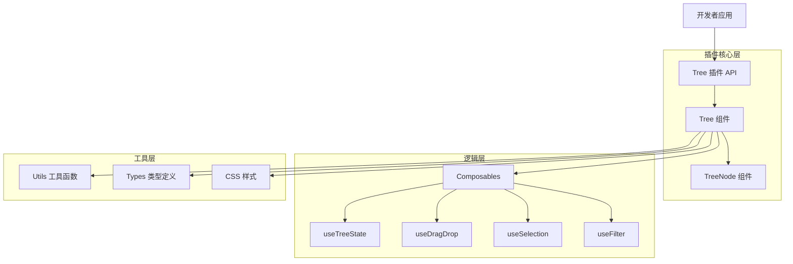
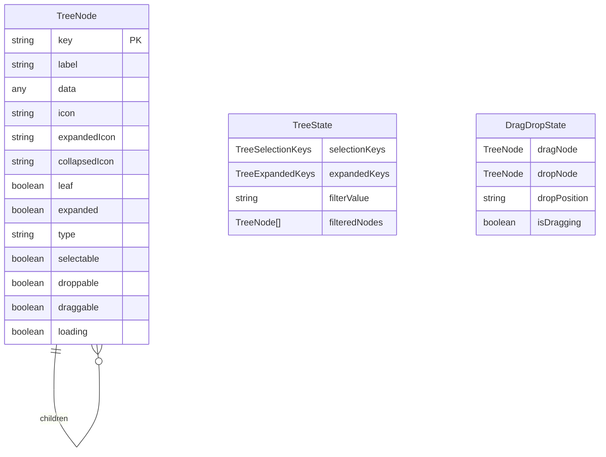

# PrimeVue Tree 组件插件 - 技术架构文档

## 1. 架构设计



## 2. 技术描述

- **前端框架**：Vue@3.4+ + TypeScript@5.0+ + Vite@5.0+
- **样式方案**：CSS Modules + PrimeVue 样式复刻
- **构建工具**：Vite + Vue SFC + TypeScript
- **类型支持**：完整 TypeScript 类型定义
- **测试框架**：Vitest + Vue Test Utils

## 3. 路由定义

| 路由 | 用途 |
|------|-----|
| /demo | 主演示页面，展示所有功能特性 |
| /demo/basic | 基础功能演示，树形结构和展开折叠 |
| /demo/selection | 选择功能演示，单选、多选、复选框模式 |
| /demo/dragdrop | 拖拽功能演示，排序和跨树拖拽 |
| /demo/lazy | 懒加载功能演示，动态数据加载 |
| /demo/template | 自定义模板演示，节点内容定制 |
| /demo/filter | 过滤功能演示，搜索和筛选 |
| /docs | API 文档页面，完整的接口说明 |

## 4. API 定义

### 4.1 核心组件 API

**Tree 组件属性**

| 属性名 | 类型 | 必需 | 描述 |
|--------|------|------|------|
| value | TreeNode[] | true | 树形数据源 |
| selectionMode | 'single' \| 'multiple' \| 'checkbox' | false | 选择模式 |
| selectionKeys | TreeSelectionKeys | false | 选中的节点键值 |
| expandedKeys | TreeExpandedKeys | false | 展开的节点键值 |
| dragdropScope | string | false | 拖拽作用域标识 |
| loading | boolean | false | 加载状态 |
| filter | boolean | false | 是否启用过滤 |
| filterMode | 'lenient' \| 'strict' | false | 过滤模式 |

**Tree 组件事件**

| 事件名 | 参数类型 | 描述 |
|--------|----------|------|
| node-select | TreeNodeSelectEvent | 节点选中时触发 |
| node-unselect | TreeNodeUnselectEvent | 节点取消选中时触发 |
| node-expand | TreeNodeExpandEvent | 节点展开时触发 |
| node-collapse | TreeNodeCollapseEvent | 节点折叠时触发 |
| node-drop | TreeNodeDropEvent | 节点拖拽放置时触发 |
| update:selectionKeys | TreeSelectionKeys | 选择状态更新 |
| update:expandedKeys | TreeExpandedKeys | 展开状态更新 |

### 4.2 类型定义

```typescript
// 树节点数据结构
interface TreeNode {
  key: string | number;
  label: string;
  data?: any;
  icon?: string;
  expandedIcon?: string;
  collapsedIcon?: string;
  children?: TreeNode[];
  leaf?: boolean;
  expanded?: boolean;
  type?: string;
  selectable?: boolean;
  droppable?: boolean;
  draggable?: boolean;
  loading?: boolean;
}

// 选择状态类型
type TreeSelectionKeys = {
  [key: string]: boolean | TreeCheckboxSelectionKeys;
} | TreeNode[] | TreeNode | null;

interface TreeCheckboxSelectionKeys {
  checked?: boolean;
  partialChecked?: boolean;
}

// 展开状态类型
type TreeExpandedKeys = {
  [key: string]: boolean;
};

// 事件类型定义
interface TreeNodeSelectEvent {
  originalEvent: Event;
  node: TreeNode;
}

interface TreeNodeDropEvent {
  originalEvent: DragEvent;
  dragNode: TreeNode;
  dropNode: TreeNode;
  dropIndex: number;
  accept: () => void;
}
```

## 5. 服务器架构图

本项目为纯前端插件，无需服务器架构。

## 6. 数据模型

### 6.1 数据模型定义



### 6.2 数据定义语言

由于这是一个纯前端插件，不涉及数据库操作。数据结构通过 TypeScript 接口定义：

```typescript
// 树节点接口定义
export interface TreeNode {
  key: string | number;
  label: string;
  data?: any;
  icon?: string;
  expandedIcon?: string;
  collapsedIcon?: string;
  children?: TreeNode[];
  leaf?: boolean;
  expanded?: boolean;
  type?: string;
  selectable?: boolean;
  droppable?: boolean;
  draggable?: boolean;
  loading?: boolean;
}

// 组件状态管理
export interface TreeState {
  selectionKeys: TreeSelectionKeys;
  expandedKeys: TreeExpandedKeys;
  filterValue: string;
  filteredNodes: TreeNode[];
}

// 拖拽状态管理
export interface DragDropState {
  dragNode: TreeNode | null;
  dropNode: TreeNode | null;
  dropPosition: 'above' | 'below' | 'inside' | null;
  isDragging: boolean;
  dragScope?: string;
}

// 初始化示例数据
export const sampleTreeData: TreeNode[] = [
  {
    key: '0',
    label: 'Documents',
    data: 'Documents Folder',
    icon: 'pi pi-fw pi-inbox',
    children: [
      {
        key: '0-0',
        label: 'Work',
        data: 'Work Folder',
        icon: 'pi pi-fw pi-cog',
        children: [
          { key: '0-0-0', label: 'Expenses.doc', icon: 'pi pi-fw pi-file', data: 'Expenses Document' },
          { key: '0-0-1', label: 'Resume.doc', icon: 'pi pi-fw pi-file', data: 'Resume Document' }
        ]
      },
      {
        key: '0-1',
        label: 'Home',
        data: 'Home Folder',
        icon: 'pi pi-fw pi-home',
        children: [
          { key: '0-1-0', label: 'Invoices.txt', icon: 'pi pi-fw pi-file', data: 'Invoices for this month' }
        ]
      }
    ]
  }
];
```