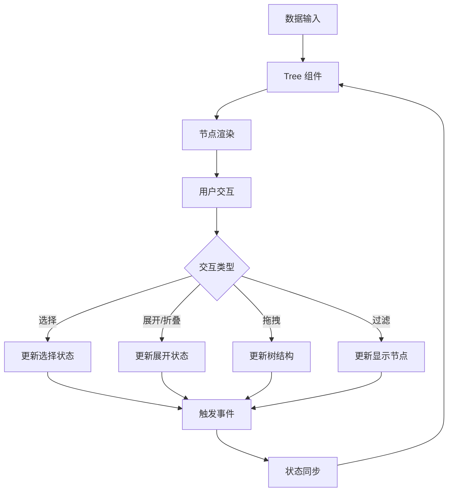

# PrimeVue Tree 组件插件 - 产品需求文档

## 1. 产品概述

本项目旨在创建一个完美复刻 PrimeVue Tree 组件的 Vue3 + TypeScript 插件，提供完整的树形数据展示和交互功能。该插件将支持层次化数据显示、多种选择模式、拖拽排序、懒加载等高级功能，为开发者提供一个功能完备且易于使用的树形组件解决方案。

## 2. 核心功能

### 2.1 用户角色
本产品主要面向前端开发者，无需区分用户角色。

### 2.2 功能模块

我们的 Tree 组件插件包含以下核心页面和功能模块：

1. **基础展示页面**：树形结构渲染、节点展开折叠、基础样式展示
2. **选择功能页面**：单选模式、多选模式、复选框模式、选择状态管理
3. **交互功能页面**：拖拽排序、跨树拖拽、事件处理、懒加载
4. **高级功能页面**：自定义模板、过滤搜索、受控状态管理
5. **演示示例页面**：完整功能演示、API 文档、使用指南

### 2.3 页面详情

| 页面名称 | 模块名称 | 功能描述 |
|---------|---------|---------|
| **基础展示页面** | 树形渲染模块 | 渲染层次化数据结构，支持节点图标、标签显示，实现展开/折叠动画效果 |
| **基础展示页面** | 状态管理模块 | 管理节点展开状态，支持 expandedKeys 双向绑定，提供展开全部/折叠全部功能 |
| **选择功能页面** | 单选模式模块 | 实现单节点选择，支持 selectionKeys 绑定，提供选择状态视觉反馈 |
| **选择功能页面** | 多选模式模块 | 支持多节点选择，可配置 metaKey 选择模式，管理选择状态集合 |
| **选择功能页面** | 复选框模式模块 | 提供复选框选择界面，支持部分选中状态，实现父子节点联动选择 |
| **交互功能页面** | 拖拽排序模块 | 实现节点拖拽重排序，支持同级拖拽和跨级拖拽，提供拖拽视觉反馈 |
| **交互功能页面** | 跨树拖拽模块 | 支持多树间节点转移，配置拖拽作用域，实现树间数据同步 |
| **交互功能页面** | 事件处理模块 | 提供完整事件系统：node-select、node-unselect、node-expand、node-collapse、node-drop |
| **交互功能页面** | 懒加载模块 | 支持动态数据加载，提供加载状态指示器，优化大数据集性能 |
| **高级功能页面** | 自定义模板模块 | 支持节点内容自定义，提供插槽系统，允许根据节点类型定制显示 |
| **高级功能页面** | 过滤搜索模块 | 实现树形数据过滤，支持 lenient 和 strict 模式，提供搜索高亮 |
| **高级功能页面** | 受控状态模块 | 支持外部状态控制，提供完整的 v-model 绑定，实现状态同步 |
| **演示示例页面** | API 文档模块 | 提供完整的 API 文档，包含属性、事件、方法说明和代码示例 |
| **演示示例页面** | 使用指南模块 | 提供安装配置指南，最佳实践建议，常见问题解答 |

## 3. 核心流程

### 开发者使用流程
1. **安装配置** → **基础使用** → **功能定制** → **高级配置**
2. 开发者首先安装插件并进行基础配置
3. 使用基础的树形展示功能，配置数据源
4. 根据需求启用选择、拖拽、过滤等功能
5. 进行高级定制，如自定义模板、懒加载等

### 组件交互流程

## 4. 用户界面设计

### 4.1 设计风格
- **主色调**：#007ad9（PrimeVue 蓝色）、#ffffff（白色背景）
- **辅助色**：#6c757d（灰色文本）、#28a745（成功绿色）、#dc3545（错误红色）
- **按钮样式**：圆角按钮，悬停效果，阴影过渡
- **字体**：-apple-system, BlinkMacSystemFont, "Segoe UI", Roboto, 14px 主要字体
- **布局风格**：卡片式布局，清晰的层次结构，充足的间距
- **图标风格**：PrimeIcons 图标集，线性风格，16px 标准尺寸

### 4.2 页面设计概览

| 页面名称 | 模块名称 | UI 元素 |
|---------|---------|---------|
| **基础展示页面** | 树形渲染模块 | 树形结构布局，节点缩进 20px，展开/折叠图标，节点图标和文本，悬停高亮效果 |
| **选择功能页面** | 选择模式模块 | 选择状态高亮（#e3f2fd 背景色），复选框样式，多选视觉反馈，选择计数显示 |
| **交互功能页面** | 拖拽模块 | 拖拽手柄图标，拖拽时半透明效果（opacity: 0.5），放置区域高亮，拖拽线条指示器 |
| **高级功能页面** | 过滤模块 | 搜索输入框，过滤结果高亮，清空按钮，无结果提示 |
| **演示示例页面** | 文档模块 | 代码高亮显示，复制按钮，实时预览区域，响应式布局 |

### 4.3 响应式设计
- **桌面优先设计**：主要针对桌面端开发环境
- **移动端适配**：支持触摸操作，调整间距和字体大小
- **触摸优化**：增大点击区域，优化拖拽手势识别